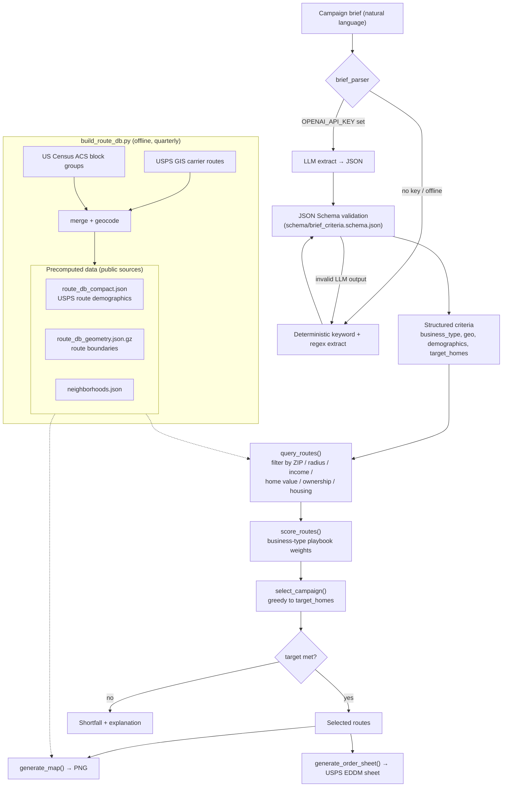

# Tract — Architecture

Tract turns a plain-language campaign brief into a selected set of USPS carrier routes plus the
paperwork to mail them. The AI/parsing layer only produces **structured criteria**; all route
selection is deterministic and reproducible.

## Layers

| Layer | File | Role |
|---|---|---|
| Brief interpretation | `scripts/brief_parser.py` | NL → validated criteria (LLM optional, deterministic fallback) |
| Criteria schema | `schema/brief_criteria.schema.json` | Draft-07 schema the criteria must satisfy |
| Route engine | `scripts/eddm_tools.py` | `query_routes` → `score_routes` → `select_campaign`, map + order sheet |
| CLI | `scripts/eddm_cli.py` | `parse`, `campaign`, and each step as a subcommand |
| Data builder | `scripts/build_route_db.py` | Rebuilds the route DB from USPS GIS + Census ACS |

## Design notes
- The LLM only extracts criteria; it never selects routes. Selection is deterministic, so the same
  criteria always yield the same routes.
- The parser always returns usable criteria (schema-validated) even with no API key and no network.
- Explicit CLI flags override anything parsed from the brief.
- No pricing, margin, vendor, or proposal logic is present — this repo selects routes and produces
  mailing paperwork only.
